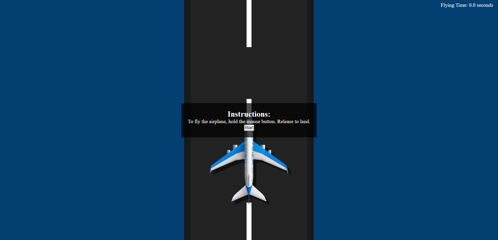

# Aeroplane Game
This is a simple animated aeroplane game built with HTML, CSS, and JavaScript.

## Overview
The Aeroplane Game is a fun and interactive web-based game where you control an aeroplane's flight. Your objective is to fly the aeroplane for as long as possible while maintaining control and skill. The game offers an exciting challenge for players to test their flying skills.

<h1 align="center">
  <a href="https://sm-aeroplane-game.netlify.app/">👉Live Demo</a>
</h1>
## Screenshots

## Instructions

To fly the aeroplane, hold the mouse button. To land the aeroplane successfully, release the mouse button. Challenge yourself to achieve the highest flying time!

## How to Play

1. Click the "OK" button in the instructions to acknowledge them.
2. Hold the mouse button to make the aeroplane fly.
3. Release the mouse button to land the aeroplane.

## Features

- Simple and intuitive controls.
- Track and display flying time.
- Option to restart the game after a successful landing.

*Enjoy playing the Aeroplane Game! If you have any feedback or suggestions, feel free to reach out to me.*
